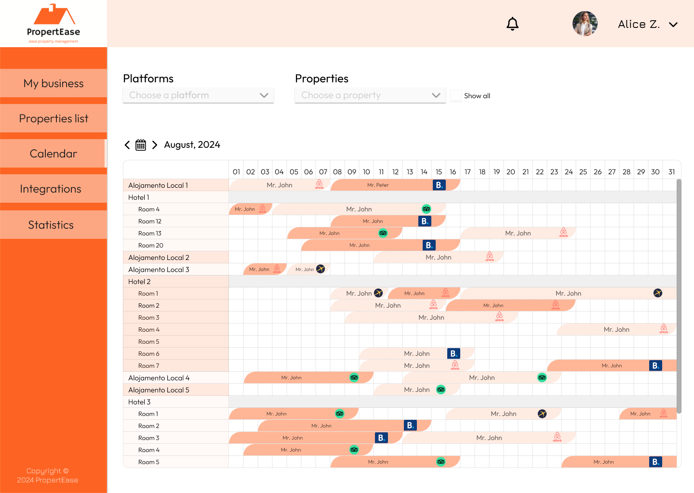
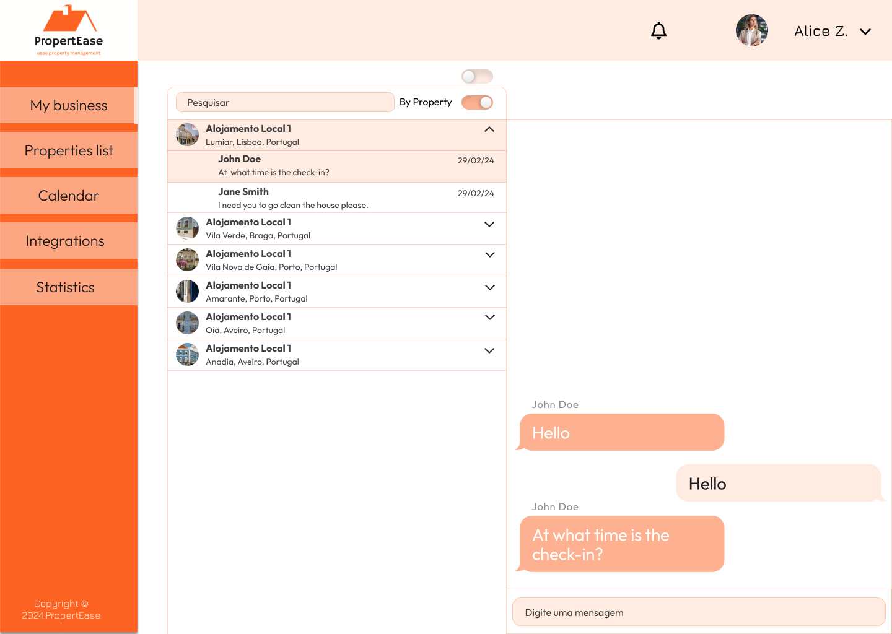
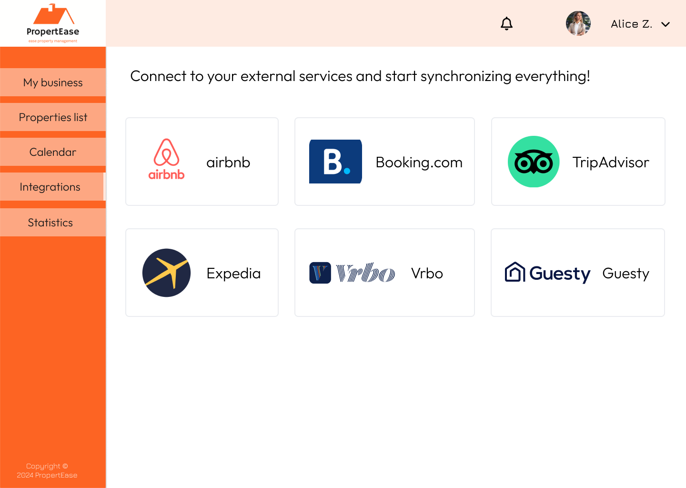
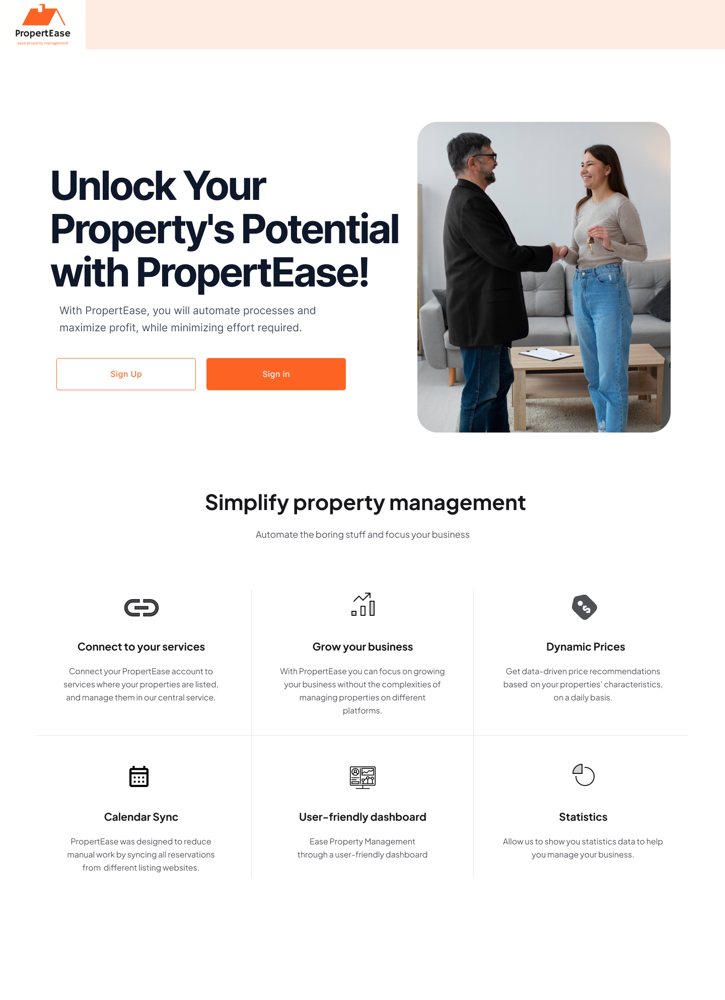
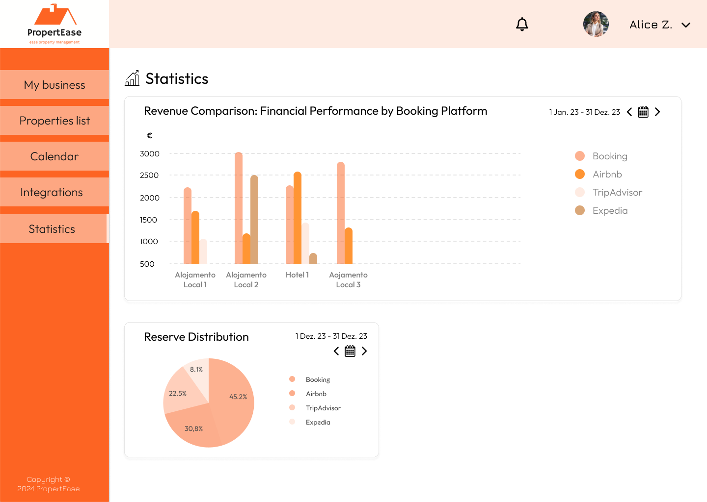

# MS2 - Elaboration Phase

Establish the baseline of the **system's architecture and requirements** and provide a stable basis for the bulk of the development effort in the next phase.
- [Presentation](https://drive.google.com/file/d/1_j8t8hRMqFecMj9ketOYNw3Qeg5u2s8E/view?usp=drive_link)

### Architecture

  
 
    #### Microservices Pattern
    - **Display service** - Provides the user interface and handles user interaction;
    - **Reverse Proxy** - Redirects user requests to the appropriate microservice. Also provides load balancing to improve scalability and improves security because no service is directly exposed to the end-user;
    - **Calendar service** - Responsible for authentication and authorization aspects;
    - **User service** - Responsible for authentication and authorization aspects;
    - **Property service** - Stores and provides all information related to a property;
    - **Website Wrapper** - Module that encapsulates each supported property listing website. Generates events regarding reservations but also handles messages produced in the bussiness layer by propagating changes to those websites;
    - **Message Queue** - Handles asynchronous and bidirectional communication between business and backoffice layer;
    - **Analytics Service** - From public housing market data does analysis on property prices and generates suggestion to property categories .
  

  
 
    </img>
  

### Mockups
- Dashboard

- Calendar

- Property Details

- Property Details - Change Price

- Property Details - Scrolled Down

- Property List

- Chat

- Integrations

- Home

- Sign In

- Sign Up

- Statistics

- Admin - Connected Services

- Admin - List of Users

- Admin - Property List Page
