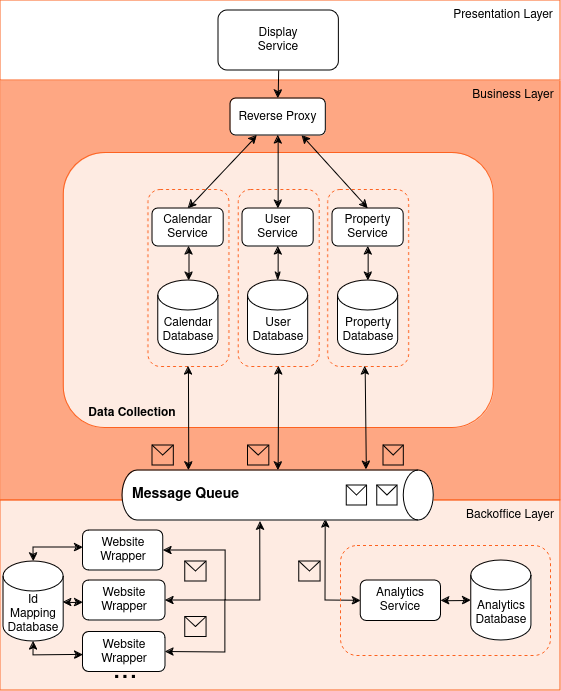

import ReactPlayer from 'react-player'

# MS3 - Construction

Development of a **functional prototype**.

- [Presentation](https://uapt33090-my.sharepoint.com/:p:/g/personal/miguel_belchior_ua_pt/EU1NEHvM1PRJix-jpoo6WTYBeVaovgmC_A6lWeqnCDqgHw?e=OdGF4I)

### Architecture

  
 
    #### Microservices Pattern
    - **Display service** - Provides the user interface and handles user interaction;
    - **Reverse Proxy** - Redirects user requests to the appropriate microservice. Also provides load balancing to improve scalability and improves security because no service is directly exposed to the end-user;
    - **Calendar service** - Responsible for the calendar synchronization between different listing services;
    - **User service** - Responsible for authentication and authorization aspects;
    - **Property service** - Stores and provides all information related to a property;
    - **Website Wrapper** - Module that encapsulates each supported property listing website. Generates events regarding reservations but also handles messages produced in the bussiness layer by propagating changes to those websites. Needs a database to map the id's of a property on external services to an internal id for that same property on the Property Service;
    - **Message Queue** - Handles asynchronous and bidirectional communication between business and backoffice layer;
    - **Analytics Service** - From public housing market data does analysis on property prices and generates suggestion to property categories .
  

  
 
    
  

### System Scenarios

#### Import Properties from external simulated services
<ReactPlayer playing controls url='/videos/m3_video1_import_properties.mp4' />

#### Others
<ReactPlayer playing controls url='/videos/m3_video2.mp4' />

#### Frontend Showcase
<ReactPlayer playing controls url='/videos/CP1_DEMO.mp4' />