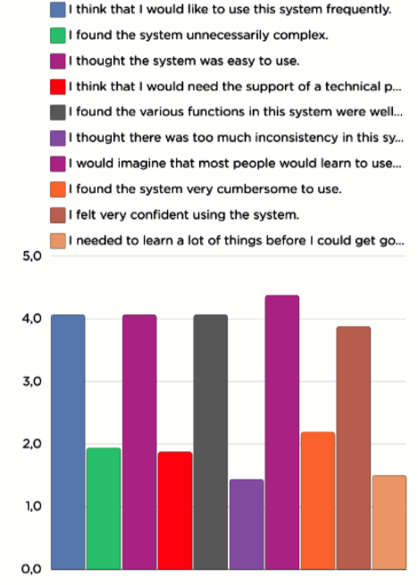
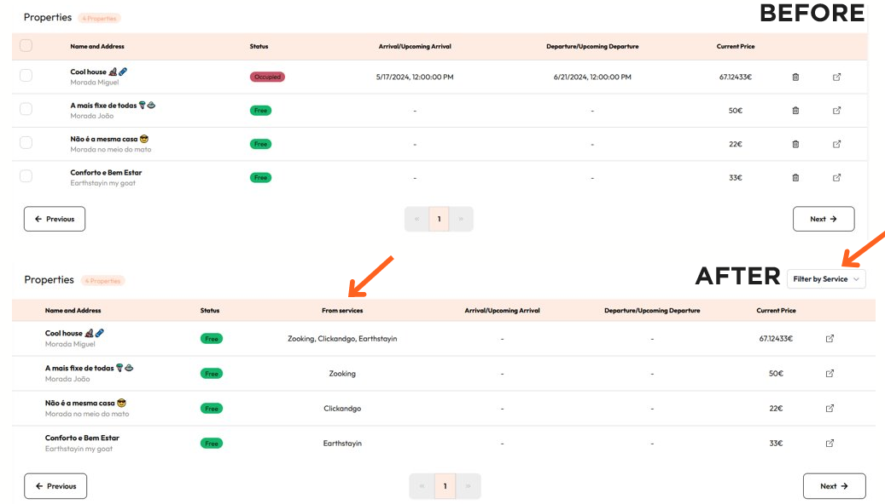
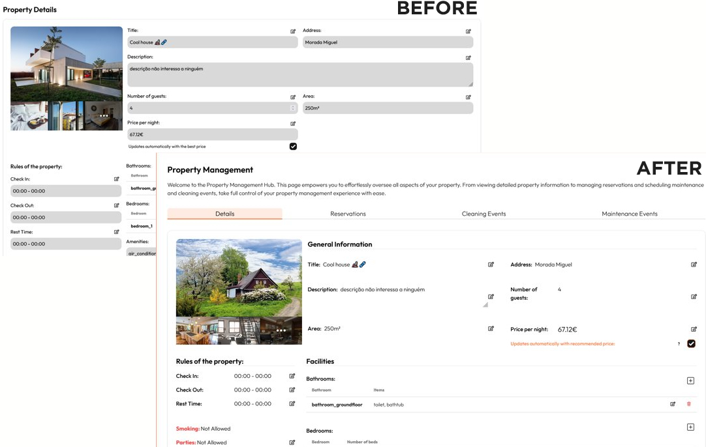
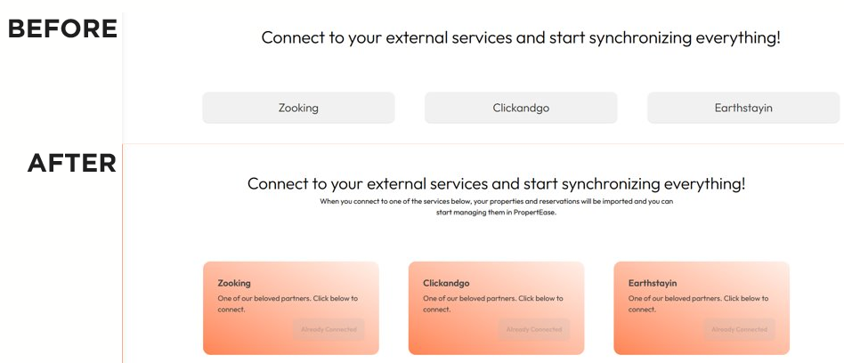
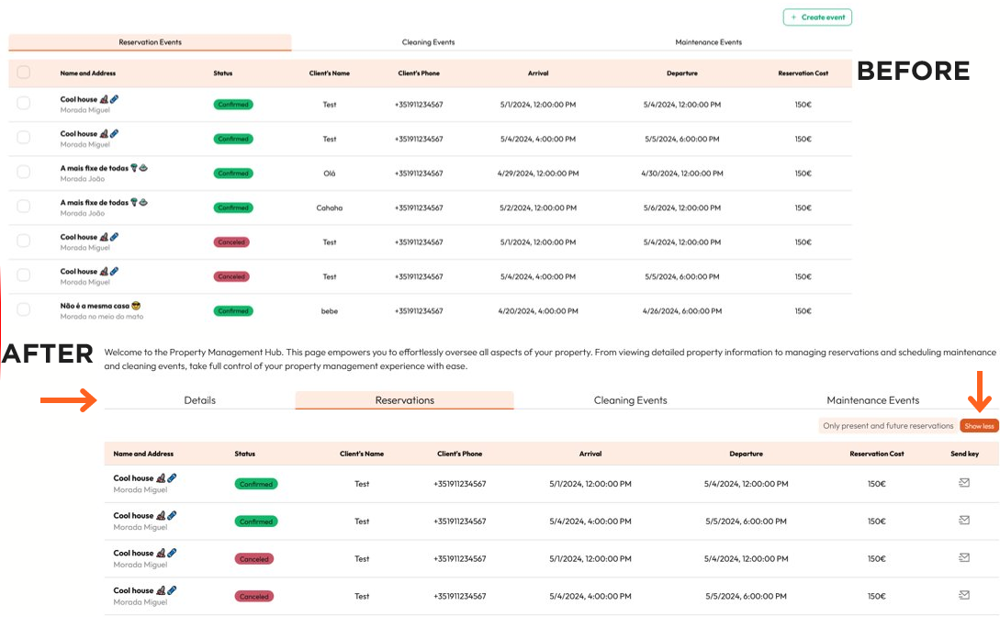
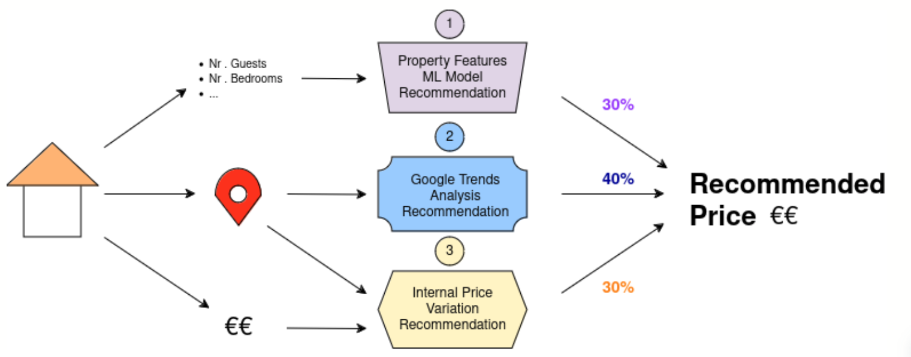

import ReactPlayer from "react-player";

# MS4 - Transition

**All functionality has been developed!**

- [Presentation](https://drive.google.com/uc?export=download&id=1onH-QOQQGWAO74wAgMqEFW8TMAR4p5t-)
- [Final Report](../../static/Report_G6_PropertEase.pdf)

## Promotional Media

### Promotional Video

<ReactPlayer
  playing
  controls
  url="/videos/PropertEase_Video_Promocion.mp4"
  width="100%"
/>

### Demo

<ReactPlayer
  playing
  controls
  url="/videos/PropertEases_PI_DEMO_WITH_SUBTITLE.mp4"
  width="100%"
/>

### Poster

## Usability Tests

  

    #### Most Important feedback: 
    - Display in which services a property is listed; 
    - Property listing page has too much detail and is not clear where to find respective reservations; 
    - Displayed past reservations aren't relevant in reservation list shouldn't be displayed unless the user decides so;

    **Number of testers: 16**  
    **Average SUS Score: 78.75%**

  

  

    
  

### Usability tests changes

- Properties List
  

- Property Details
  

- Channel Manager
  

- Reservations List
  

## Price Recommendation Algorithm

- **Property Features ML Model**

  - Random Forest Regression
  - Nr. of: guests, beds, bedrooms, bathrooms, amenities, latitude and longitude
  - Recommend prices based on median property
  - Training data from InsideAirbnb, Lisbon, 76716 entries, train/test split: 75-25

- **Google Trends Analysis**

  - Obtain search values for location
  - Calculate % increase/decrease
  - Reflect it on prices logarithmically
  - Protected against “bad” trends

- **Internal Price Variation**
  - Detect internal price variations
  - “Backup” for Google Trends
